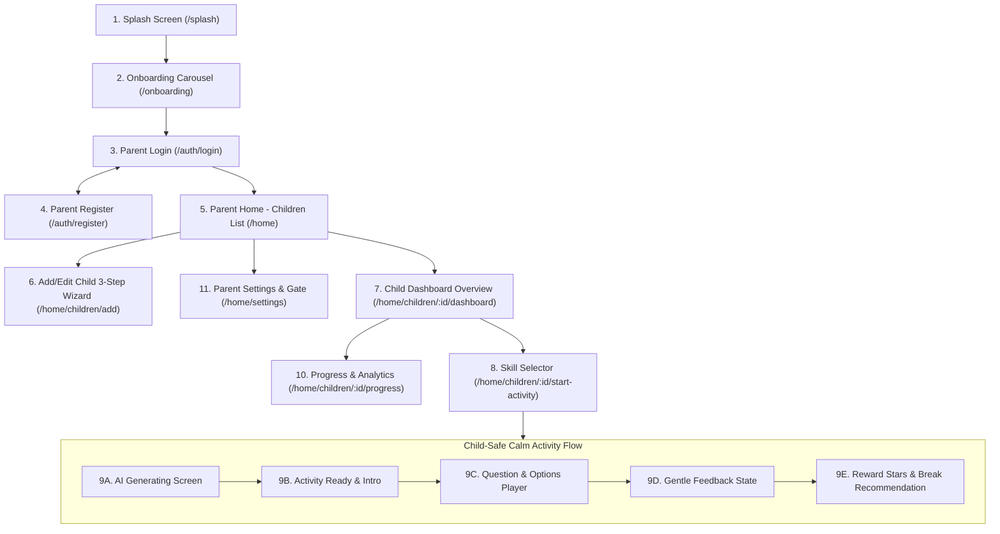

# NOVA Mobile App - Design System & Screen Specifications
# Document: `design.md`

---

## 1. Overview & Design Philosophy

**NOVA** is an adaptive learning mobile application built with Flutter, designed to support children on the autism spectrum through short, personalized, AI-generated activities (powered by a Node.js backend), while providing parents with actionable progress tracking and insights.

### Non-Negotiable Principles:
1. **Educational & Support Tool (NOT Diagnostic)**: NOVA is an educational support companion. It must **never** diagnose or imply medical diagnosis anywhere in the UI or UX.
2. **Arabic-First with Strict RTL**: Complete Right-to-Left (RTL) layout support using `EdgeInsetsDirectional`, `AlignmentDirectional`, and externalized ARB localization files.
3. **Calm, Sensory-Friendly Child Experience (Sensory-Calm UX)**:
   - **No Sensory Overload**: Zero screen flashing, no rapid or chaotic animations, no harsh negative buzzer sounds.
   - **No Red Error States**: Never use bright red colors or jarring failure markers for wrong answers. Instead, use a calming peach/soft amber **Gentle Retry** state.
   - **No Visible Timers**: The child activity player must never display countdown timers or stress-inducing counters.
   - **One Question Per Screen**: Eliminates visual clutter and maintains complete focus.
   - **Large Touch Targets**: Minimum **64dp** interactive height for child-facing buttons, and **48dp** for parent-facing controls.
4. **Dual Experience Architecture**:
   - **Parent Space**: Data-rich, serene, clean Material 3 inspired dashboard with a secure Parental Gate.
   - **Child Space**: Distraction-free, immersive, warm, and sensory-safe gamified learning environment.

---

## 2. Design Tokens & Visual Identity

### Color System (`AppColors`)

| Token Name | Hex Code | Visual Swatch | Purpose & Role |
| :--- | :--- | :--- | :--- |
| **Primary** | `#5C6BC0` | Slate Indigo | Main brand color, key buttons, and app bars |
| **Secondary** | `#9575CD` | Soft Lilac | Accent badges, category tags, secondary highlights |
| **Background** | `#F7F9FC` | Calm Off-White | Soothing main canvas, prevents eye strain |
| **Surface** | `#FFFFFF` | Pure White | Elevated cards, dialogs, form containers |
| **Surface Variant**| `#EFF1FB` | Soft Tinted Blue | Highlighted cards, call-to-actions, tinted headers |
| **Success** | `#66BB6A` | Gentle Green | Positive reinforcement, completed indicators |
| **Gentle Retry** | `#FFB74D` | Soft Amber/Peach | Non-punitive retry state (**Strictly NO harsh red**) |
| **Text Primary** | `#212121` | Soft Charcoal | High-contrast readable typography (no stark pitch black) |
| **Text Secondary**| `#595959` | Medium Gray | Subtitles, helper captions, secondary labels |
| **Text Disabled** | `#9E9E9E` | Light Gray | Inactive controls, placeholder inputs |
| **Star Filled** | `#FFD54F` | Pastel Gold | Reward stars, milestone highlights |
| **Star Empty** | `#EEEEEE` | Muted Gray | Inactive star slots |
| **Border / Divider**| `#CFD8DC` | Border Slate | Clean boundaries and subtle card dividers |

### Spacing & Sizing Scale (`AppSpacing`)
- `xs`: **4dp** | `sm`: **8dp** | `md`: **12dp** | `lg`: **16dp** | `xl`: **20dp** | `xxl`: **24dp** | `xxxl`: **32dp**

### Corner Radius
- **Cards & Form Fields**: `16dp` rounded corners.
- **Child Player Option Buttons & Containers**: `20dp - 28dp` pill/rounded corners.
- **Badges & Filter Chips**: `12dp` or fully rounded pill shape.

### Typography Scale
- **Display / Top Titles**: 24sp - 28sp (Bold, high readability).
- **Child Activity Question Prompts**: 22sp - 24sp (Prominent, relaxed line height).
- **Child Activity Option Labels**: 18sp - 20sp (Bold, centered, easy-to-read).
- **Parent Dashboard Headings**: 18sp - 20sp (Semi-bold).
- **Body & Subtitles**: 14sp - 16sp (Regular / Medium).

---

## 3. Information Architecture & Navigation Flow



---

## 4. Comprehensive Screen Specifications

---

### Screen 1: Splash Screen (`/splash`)
- **Route**: `RouteNames.splash` -> `/splash`
- **Purpose**: Checks authentication and onboarding status before navigating.
- **Visual Elements**:
  - **Background**: Soft gradient or soothing canvas (`#5C6BC0` to `#7986CB`).
  - **Center Logo**: Soft glowing star constellation icon (🌟).
  - **App Title**: **"نَوْا - NOVA"** in modern bold Arabic typography.
  - **Tagline**: "منصة التعلم التكيفي للأطفال" *(Adaptive Learning Platform for Children)*.
  - **Bottom**: Gentle ambient pulsing indicator (no rapid spinning).

---

### Screen 2: Parent Onboarding Carousel (`/onboarding`)
- **Route**: `RouteNames.onboarding` -> `/onboarding`
- **Purpose**: Educates the parent on NOVA's adaptive learning method across 3 gentle slides.
- **Visual Elements**:
  - **Top Bar**: Right-aligned "تخطي" *(Skip)* text button navigating directly to Login.
  - **Slide 1 (Personalized AI)**:
    - Soft yellow circular container (`#FFF9C4`) with lightbulb icon (`#F9A825`).
    - Title: "أنشطة مصممة خصيصاً لطفلك" *(Activities personalized for your child)*.
    - Body: "تتكيف الأنشطة الذكية تلقائياً مع اهتمامات طفلك وأسلوب تعلمه ومستواه الحالي لضمان رحلة ممتعة."
  - **Slide 2 (Sensory-Safe Environment)**:
    - Soft pink circular container (`#FCE4EC`) with heart icon (`#EC407A`).
    - Title: "بيئة هادئة وآمنة حسياً" *(Calm, sensory-safe environment)*.
    - Body: "تجربة خالية من التشتت والضغط الزمني والألوان الصاخبة لتناسب وتيرة طفلك الخاصة."
  - **Slide 3 (Parent Insights)**:
    - Soft green circular container (`#E8F5E9`) with chart icon (`#43A047`).
    - Title: "رؤى واضحة لولي الأمر" *(Clear insights for parents)*.
    - Body: "تقارير بيانية تفصيلية توضح تطور المهارات وتساعدك في دعم رحلة نموه يومياً."
  - **Page Indicator**: 3 smooth horizontal pill dots.
  - **Bottom CTA**: Primary button (height 56dp, `#5C6BC0`): "التالي" *(Next)* / "ابدأ الآن" *(Get Started)*.

---

### Screen 3: Parent Login (`/auth/login`)
- **Route**: `RouteNames.login` -> `/auth/login`
- **Visual Elements**:
  - **Header**: App logo mark, Title: "تسجيل الدخول" *(Sign In)*, Subtitle: "أهلاً بك مجدداً، تابع رحلة تطور طفلك".
  - **Input Fields**:
    - Email field: Leading icon `mail_outline`, placeholder "البريد الإلكتروني".
    - Password field: Leading icon `lock_outline`, toggle trailing eye icon `visibility_off`.
  - **Action Button**: Full-width primary button (height 52dp, radius 14px): "دخول" *(Sign In)*.
  - **Navigation Link**: "ليس لديك حساب؟ إنشاء حساب جديد" *(Don't have an account? Create account)*.
  - **Legal/Medical Disclaimer**: Centered bottom caption: *"نوا هو أداة تعليمية وتنموية داعمة، وليس أداة تشخيص طبي."* *(NOVA is an educational support tool, not a medical diagnostic tool)*.

---

### Screen 4: Parent Register (`/auth/register`)
- **Route**: `RouteNames.register` -> `/auth/register`
- **Visual Elements**:
  - **App Bar**: Back button pointing right (RTL), Title: "إنشاء حساب جديد" *(Create Account)*.
  - **Input Form**:
    - Full Name field (`person_outline`).
    - Email field (`mail_outline`).
    - Password field with validation rules caption.
    - Confirm Password field.
  - **Primary Action**: Button "إنشاء الحساب" *(Register Account)* in `#5C6BC0`.
  - **Footer Link**: "لديك حساب بالفعل؟ تسجيل الدخول" *(Already have an account? Sign in)*.

---

### Screen 5: Parent Home & Children List (`/home`)
- **Route**: `RouteNames.home` -> `/home`
- **Visual Elements**:
  - **App Bar**:
    - Deep indigo background `#5C6BC0`, Title: "أطفالي" *(My Children)*.
    - Actions: Settings gear button (`settings_outlined`) navigating to `/home/settings`.
  - **Greeting Card**: "مرحباً بك! اختر طفلاً لمتابعة نشاطه اليومي".
  - **Child Profile Cards**:
    - Avatar circle with friendly animal/character avatar.
    - Child Name (e.g., "عمر"), Age (e.g., "٦ سنوات").
    - Learning Style badge: ("بصري" Visual / "سمعي" Auditory / "مختلط" Mixed).
    - Summary of assigned skills and level.
    - Forward navigation chevron (pointing left in RTL).
  - **Floating Action Button (FAB)**:
    - Extended FAB: Icon `+`, Label: "إضافة طفل" *(Add Child)* in `#5C6BC0` (Hidden if child count >= 5).
  - **States**: `LoadingView`, `EmptyView` ("لم تقم بإضافة ملف طفل بعد"), `ErrorView` with Retry.

---

### Screen 6: Add / Edit Child Profile Wizard (`/home/children/add`)
- **Route**: `RouteNames.addChild` -> `/home/children/add` (or `editChild`)
- **Visual Elements**:
  - **App Bar**: Title "إضافة ملف طفل" *(Add Child Profile)* / "تعديل ملف طفل".
  - **Step Progress Indicator**: 3 connected steps at the top:
    - Step 1: البيانات الأساسية *(Identity)*
    - Step 2: أسلوب التعلم *(Learning Style)*
    - Step 3: المهارات *(Target Skills)*
  - **Step 1 Content (Identity)**:
    - Child's Name input field.
    - Birth Date picker field with calendar picker modal.
    - Avatar Selection: Horizontal row of 5 cute character avatars.
  - **Step 2 Content (Style & Interests)**:
    - Learning style segmented pills: [ بصري 👁️ | سمعي 🎧 | مختلط 🌟 ].
    - Interests chips (multi-select): 🦁 Animals, 🚀 Space, 🎨 Art, 🔢 Numbers, 🚗 Cars, 🧩 Puzzles.
  - **Step 3 Content (Target Skills)**:
    - Multi-select checkbox cards for skills: "التعرف على المشاعر", "التمييز البصري", "التواصل الاجتماعي".
  - **Bottom Step Bar**: "السابق" *(Back)* outline button + "التالي" *(Next)* / "حفظ" *(Save)* filled button.

---

### Screen 7: Child Dashboard (`/home/children/:id/dashboard`)
- **Route**: `RouteNames.childDashboard` -> `/home/children/:childId/dashboard`
- **Visual Elements**:
  - **Sliver Header (App Bar)**:
    - Indigo background `#5C6BC0`.
    - Large Child Avatar, Child Name, Age, and Learning Style pill.
  - **Primary CTA Card ("Start Play")**:
    - Elevated container with `#EFF1FB` background.
    - Large Play Icon.
    - Title: "جلسة التعلم الذكية جاهزة لطفلك!" *(Smart learning session ready!)*.
    - Button (height 56dp): "ابدأ اللعب الآن 🚀" *(Start Playing Now)*.
  - **Next Recommendation Card**:
    - AI-suggested skill: "التعرف على المشاعر (مستوى مبتدئ)".
    - Reason caption: "بناءً على أداء الجلسات السابقة" *(Based on previous sessions)*.
  - **Quick Stats 2x2 Grid**:
    - Sessions this week: "٨ جلسات".
    - Success Rate: "٨٥%".
    - Daily Streak: "٤ أيام 🔥".
    - Total Time: "٤٥ دقيقة".
  - **Full Progress Report Link Card**:
    - Title: "عرض تقرير التقدم المفصل 📊" navigating to `/home/children/:childId/progress`.

---

### Screen 8: Skill Selection Screen (`/home/children/:id/start-activity`)
- **Route**: `RouteNames.startActivity` -> `/home/children/:childId/start-activity`
- **Visual Elements**:
  - **App Bar**: Title "اختر مهارة" *(Select a Skill)*.
  - **Header Card**: Greeting with child's name: "ماذا سنلعب اليوم يا عمر؟"
  - **Skills Card List**:
    - Skill 1: Icon 🎭, Title "التعرف على المشاعر", Badge "مبتدئ" (Beginner) in soft green.
    - Skill 2: Icon 🧩, Title "مطابقة الأشكال", Badge "متوسط" (Intermediate) in soft blue.
    - Skill 3: Icon 🗣️, Title "التواصل والتعبير", Badge "مبتدئ".
  - Tapping any skill instantly generates an activity for that child & skill.

---

### Screen 9: Child Activity Player (`/home/activity`)
- **Route**: `RouteNames.activity` -> `/home/activity`
- **Neurodiversity Rules**: Fullscreen immersive, no standard bottom navigation, parental gate on exit button.

#### 9A. AI Generating Screen (`GeneratingView`)
- Smooth, calming mascot or rocket floating animation.
- Soothing pulse circle.
- Caption: "نُجهّز نشاطاً مميزاً لأجلك... 🎨" *(Preparing a special activity for you...)*.
- **Zero visible percentage counters or progress pressure**.

#### 9B. Activity Intro / Ready Screen (`ActivityIntroView`)
- Centered card (24dp radius) with large emoji/illustration (e.g., 🍎).
- Activity Title: "رحلة البحث عن الفواكه" *(Fruit Adventure)*.
- Friendly prompt: "سنلعب معاً ونتعرف على الألوان والأشكال اللذيذة!".
- Large Start Button (height >=68dp): "أنا مستعد! هيا نبدأ 🎈" *(I am ready! Let's start)*.

#### 9C. Active Question Screen (`QuestionView`)
- **Top Step Dots**: Subtle dot indicator showing current question (e.g., Question 2 of 3) — **NO TIMERS**.
- **Audio TTS Button**: Round floating button with `volume_up` icon to speak the question aloud in Arabic.
- **Center Prompt Card**:
  - Large friendly emoji / illustration in center.
  - Question text in 24sp Arabic font: **"أين التفاحة الحمراء؟"** *(Where is the red apple?)*.
- **3 Answer Options**:
  - 3 large stacked cards with minimum **64dp** height each.
  - Option A: "تفاحة حمراء 🍎"
  - Option B: "موزة صفراء 🍌"
  - Option C: "عنب بنفسجي 🍇"
  - Clean white background, soft border, high-contrast charcoal text.
  - *Validation is strictly backend-driven (`POST /sessions/:id/answers`).*

#### 9D. Gentle Feedback States (`AnswerFeedbackView`)
- **Correct State**:
  - Soft green border glow (`#66BB6A`).
  - Smiling star animation 🌟 with gentle chime sound.
  - Encouraging Arabic text: "أحسنت صنعاً يا بطل! 👏" *(Great job, hero!)*.
  - Button: "السؤال التالي ➡️" *(Next Question)*.
- **Gentle Retry State (Wrong Answer)**:
  - **STRICTLY NO RED COLOR, NO harsh buzzer, NO "X" icons**.
  - Warm amber/peach border (`#FFB74D`) and soft light background.
  - Encouraging prompt: "محاولة رائعة! فكر مرة أخرى يا بطل 💡" *(Great try! Think again)*.
  - Button: "جرّب مرة أخرى" *(Try again)* (Allows up to 3 attempts).

#### 9E. Activity Result & Reward Screen (`ResultView`)
- 1 to 3 soft golden stars animated smoothly (`#FFD54F`).
- Title: "تهانينا! لقد أنهيت النشاط بنجاح 🎉" *(Congratulations! Activity completed)*.
- Success rate card and skill level promotion announcement (if applicable).
- **Break Suggestion Card (If session was lengthy)**:
  - Soft mint green card with leaf icon 🌿: "حان وقت استراحة قصيرة وشرب الماء!" *(Time for a short break and some water!)*.
- Action Buttons:
  - Button 1: "العودة للرئيسية 🏠" *(Return Home)* in `#5C6BC0` (height >=64dp).
  - Button 2: "نشاط آخر 🔁" *(Another Activity)*.

---

### Screen 10: Progress & Analytics (`/home/children/:id/progress`)
- **Route**: `RouteNames.progress` -> `/home/children/:childId/progress`
- **Visual Elements**:
  - **App Bar**: Title "تقرير التقدم" *(Progress Report)*, Info button showing non-diagnostic medical disclaimer.
  - **Range Filter Segmented Control**: [ ٧ أيام (7d) | ٣٠ يوماً (30d) | ٩٠ يوماً (90d) ].
  - **Line Chart (`fl_chart`)**:
    - Smooth curved line in `#5C6BC0` with gradient fill below.
    - Shows average success rate percentage over the selected date range.
  - **Skills Mastery Cards**:
    - Skill name, Level badge (مبتدئ / متوسط / متقدم), percentage progress bar, completed sessions count.
  - **Recent Sessions History**:
    - Chronological list: Date, Activity title, Duration ("٤ دقائق"), and star rating (⭐⭐⭐).

---

### Screen 11: Parent Settings & Parental Gate (`/home/settings`)
- **Route**: `RouteNames.settings` -> `/home/settings`
- **Parental Security Gate Modal (`ParentGateDialog`)**:
  - Modal challenge displayed before entering settings from the child interface: "بوابة أولياء الأمور 🔒 - ما هو ناتج 4 + 3 ؟" with numeric keypad.
- **Settings Screen Sections**:
  - **Learning Experience**:
    - Toggle: "الأصوات والمؤثرات" *(Sound effects)*.
    - Toggle: "قراءة الأسئلة صوتياً (TTS)" *(Auto text-to-speech)*.
    - Toggle: **"تقليل الحركة (Reduce Motion)"** *(Disables complex transitions for sensitive children)*.
  - **Text Size**:
    - Font scale selector [ عادي Normal | كبير Large | كبير جداً Extra Large ].
  - **Parent Account**:
    - Update parent name, Logout button, Delete account option.
  - **About NOVA**:
    - Version number, Privacy Policy, and Educational Tool Disclaimer.

---

## 5. Shared Reusable UI States

Every screen implements three standardized visual states:
1. **`LoadingView`**: Calming centered circular spinner in `#5C6BC0` with off-white background `#F7F9FC`.
2. **`ErrorView`**: Friendly Arabic error message, supportive tone, and prominent "إعادة المحاولة" *(Retry)* button.
3. **`EmptyView`**: Whimsical warm illustration with helpful guidance on how to add data (e.g., adding the first child).

---

## 6. Stitch AI Generation Prompts

When generating screens in **Stitch AI**, follow this standardized prompt template:

```markdown
Platform: Flutter Mobile (Android & iOS)
Language & Direction: Arabic (Strict Right-to-Left RTL)
Visual Style: Calming, Neuroinclusive, Material 3, Soft Rounded (16-24dp radius)
Color Palette:
- Primary: #5C6BC0 (Slate Indigo)
- Background: #F7F9FC (Warm Off-White)
- Accents: #9575CD (Soft Lilac), #66BB6A (Gentle Green), #FFB74D (Soft Amber)
- Text: #212121 (High Contrast Charcoal)
Accessibility Constraints:
- Child touch targets >= 64dp
- Parent touch targets >= 48dp
- Strictly NO harsh red error states, NO visible countdown timers
```
